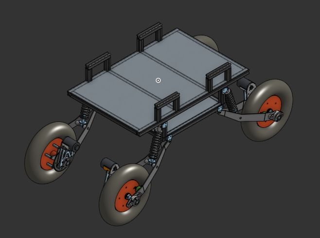

# offroad-ugv-mechanical-design
My work as Mechatronics Intern at Vrishchik Technologies

---
## What this is



This is a four wheeled trailing arm UGV designed for offroad logistics, developed at Vrishchik Technologies LLP. This repository is the **mechanical design report** containing CAD exports, renders, and drawings.

🔗 **[OnShape document link](https://cad.onshape.com/documents/ce47fbc74609b5a048dd3107/w/da249aea21ef6462a706381d/e/cdb04b3c972b51afe68cf9e2)**

---
## My role

As the Mechatronics Intern on this project, I worked on:
- Chassis load analysis, material selection, geometry analysis, design, structural analysis, and manufacturing 
- Trailing arm suspension kinematics, bearing selection, coilover sizing, design, and manufacturing
- Axle load case definition, stress analysis, material selection
- Evaluating chain drive sprocket mounting methods for manufacturability
- Chassis and mount design for onboard power and electronics

---
## Skills & tools demonstrated

- **CAD:** OnShape (parametric assemblies, dimensioned drawings for fabrication)
- **Suspension kinematics:** motion ratio calculation and tuning to hit a target wheel travel
- **Structural analysis:** stress and fatigue factor-of-safety calculation for axle sizing
- **DFM:** parts designed for minimal manufacturing complexity and cost
- **Manufacturing-aware design:** parts designed across 3D printing, CNC, laser cutting, and metal sheet bending

---
## Design highlights

**Chassis:** Aluminium T-Slot extrusions for weight management and rigidity (against bending and compression)

**Trailing arm suspension:** UCF205 pillow block bearings, ATV coilover shocks, ~200mm wheel travel

**Rear axle:** 304 stainless steel, fatigue FoS ≈ 2.4

---
## Repository map

```
TRAKR-rover/
├── README.md               ← you are here
├── Assembly/
│   ├── 3D_files/                Files of 3D printed components
│   ├── final_assembly.step              
│   ├── final_assembly.stl                
│   └── pictures/                 Pictures of assemblies and certain important components
└── drawings/                    dimensioned PDFs for anything fabricated
```

---
## Key specifications

| Parameter | Value |
|---|---|
| Overall dimensions (L×W×H) | 1m x 0.6m x 0.5m |
| Mass (as designed) | 100kg |
| Payload capacity | 100-120kg |
| Ground clearance | 300mm |
| Max traversable slope | 30 degrees |
| Wheel diameter | 14.5" |
| Primary materials | Aluminium, Mild steel |

---
## Fabrication

**Processes used:** 3D printing / CNC / laser cutting / sheet metal bending

**What has been completed:**
	- Chassis frame
	- First version of trailing arm suspension
